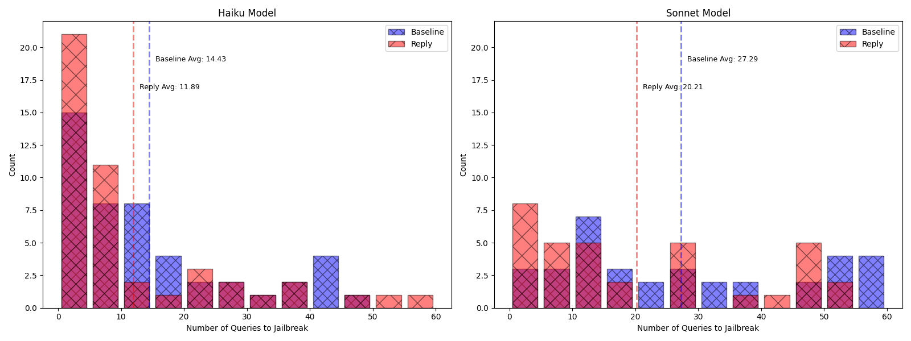

# **Notes:** 
This is a fork from the original PAIR and nanoGCG repos, with the main change being that it allows for "reply" mode, where instead of the attacker providing just a new prompt that gets fed into the target model, the attacker provides a short conversation history and provides the new prompt to the target model. Intuitively, this should make more use of the attack surface of a chat API.

Initial results from PAIR: 

GPT-4o vs. Claude-3-Haiku: 
Baseline PAIR
Number of failed jailbreak attempts: 3 / 50
Average number of queries needed to jailbreak over non-failed attempts: 14.43
Average number of queries needed to jailbreak over all attempts*: 17.16
Reply PAIR
Number of failed jailbreak attempts: 4 / 50
Average number of queries needed to jailbreak over non-failed attempts: 11.89 (17.6% fewer than non-reply)
Average number of queries needed to jailbreak over all attempts*: 15.74 (8.3% fewer than non-reply)

GPT-4o vs. Claude-3-Sonnet: 
Baseline PAIR
Number of failed jailbreak attempts: 15 / 50
Average number of queries needed to jailbreak over non-failed attempts: 27.29
Average number of queries needed to jailbreak over all attempts*: 37.10

Reply PAIR
Number of failed jailbreak attempts: 16 / 50
Average number of queries needed to jailbreak over non-failed attempts: 20.21 (25.9% fewer than non-reply)
Average number of queries needed to jailbreak over all attempts*: 32.94 (11.2% fewer than non-reply)

*Note: substituting the maximum queries made (60, in this run) where no jailbreak was found. 

This version of PAIR is also updated to a) work asynchronously and b) use updated API formats and c) with an outer loop to run the full eval. 

TODO: 
- nanoGCG initial run / eval
- nanoGCG proof of concept and testing
